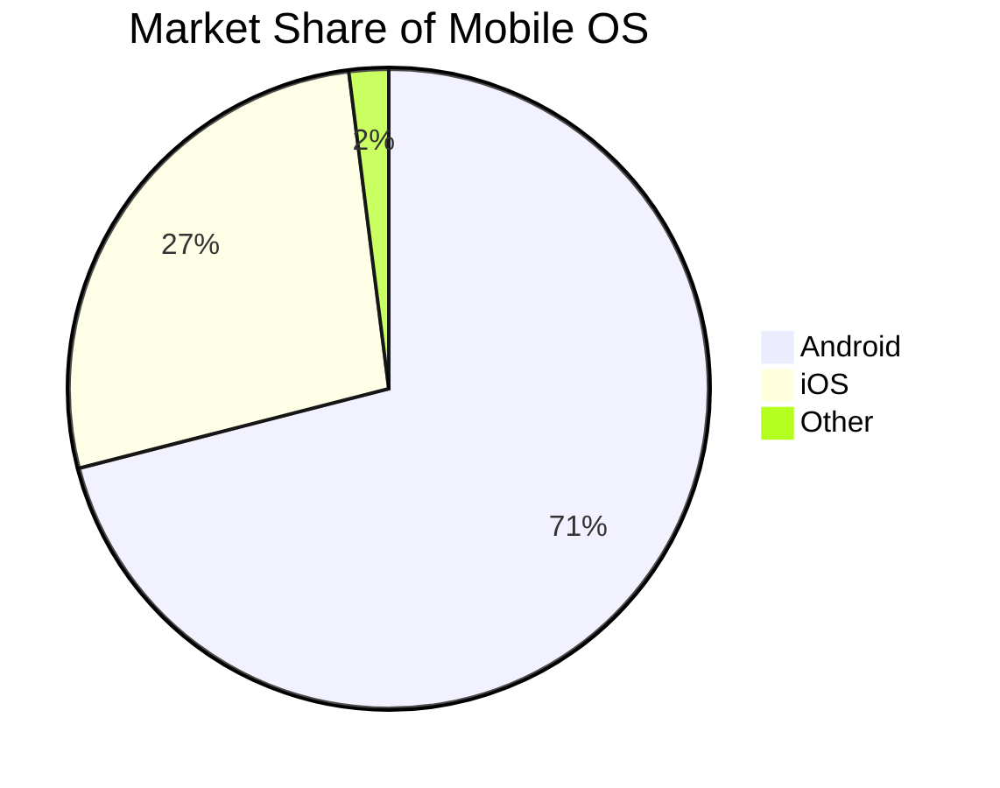
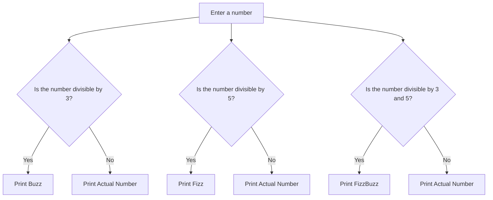
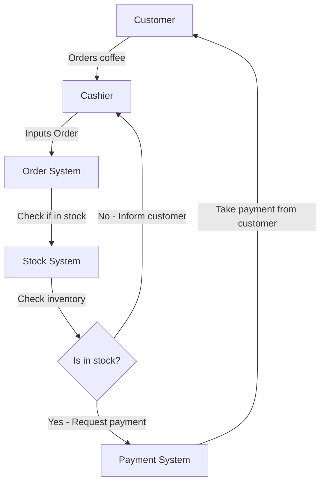

# mermaid-examples

Example 1

```mermaid
    pie title Market Share of Mobile OS
        "Android" : 71
        "iOS" : 27
        "Other" : 2
```

Example 2

```mermaid
    flowchart TD
    A[Enter a number] --> B{Is the number divisible by 3?}
    A[Enter a number] --> C{Is the number divisible by 5?}
    A[Enter a number] --> D{Is the number divisible by 3 and 5?}
        B --> |Yes| E[Print Buzz]
        B --> |No| F[Print Actual Number]
        C --> |Yes| G[Print Fizz]
        C --> |No| H[Print Actual Number]
        D --> |Yes| I[Print FizzBuzz]
        D --> |No| J[Print Actual Number]
```

Example 3

```mermaid
    flowchart TD
    A[Customer] -->|Orders coffee| B[Cashier]
    B --> |Inputs Order| C[Order System]
    C -->|Check if in stock| D[Stock System]
    D --> |Check inventory| E{Is in stock?}
    E --> |Yes - Request payment| F[Payment System]
    E --> |No - Inform customer| B[Cashier]
    F --> |Take payment from customer| A[Customer]
```