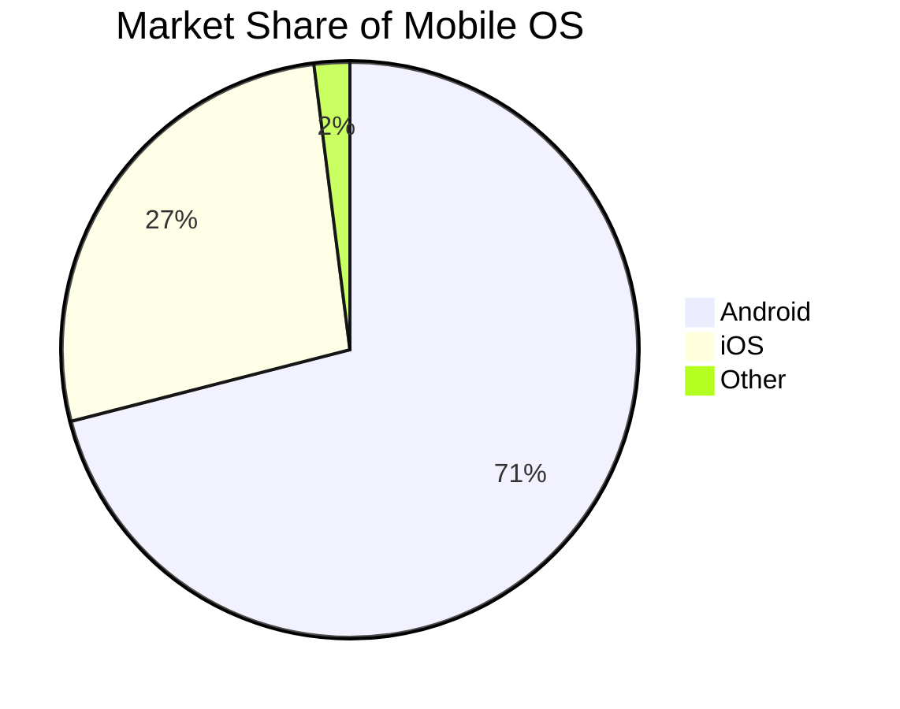
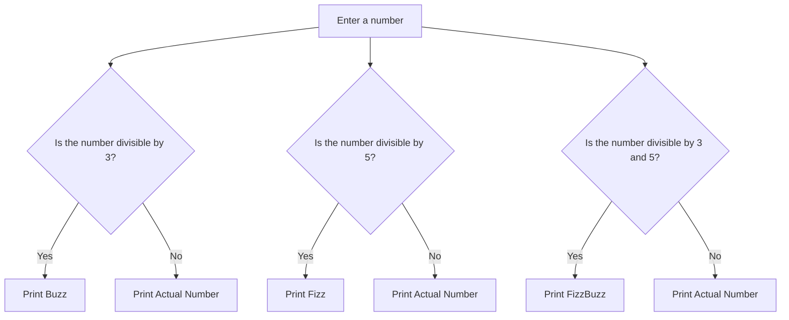
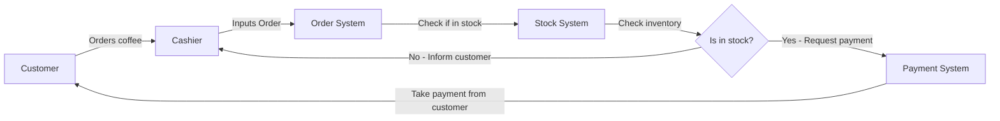
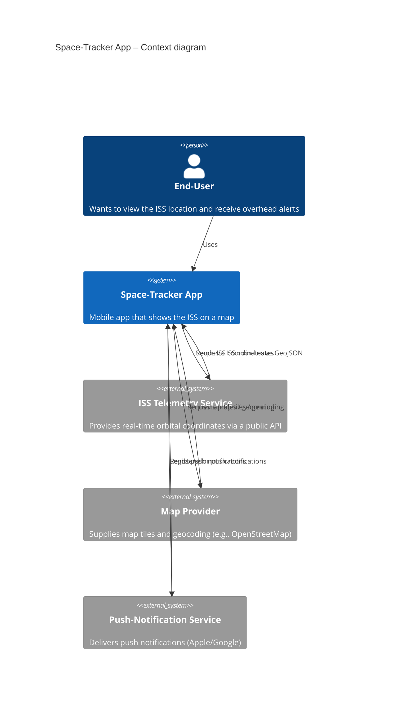

# mermaid-examples

Example 1

---
Example 2

A flow chart of the FizzBuzz game Enter a number. If the number is divisible by 3 print buzz. If the number is divisible by 5 print fizz. If the number is divisible by 3 and 5 print fizzbuzz. Otherwise, print the actual number

---
Example 3

---
Example 4 (AEC Task 1)

A small team needs a digital task management board that allows users to create tasks, assign them to team members, update their status, and mark them as complete. The board should support real-time updates, enabling team members to see changes instantly while keeping the interface simple and user-friendly.

```mermaid
    flowchart LR
    A[Product owner] -->|Logs in| B[Authentication System]
    B --> |Checks credentials| C{Are the credentials valid?}
    C -->|No| A[Product Owner]
    C -->|Yes| D[Front-End System]
    D --> E{Are you Product Owner?}
    E -->|Yes| F[Build Task Columns & Add configuration settings]
    E -->|No| G[Add task to board]
    F -->|Invite team members to board| B[Authentication System]
    G -->|Send task to database| H[Database]
    H -->|Selects task| I{Did the user make a change to the task?}
    I -->|Yes - Update database| H[Database]
    I -->|No - Assign team member to task| J[Member Assigned]
    J --> K{Has tasks status changed?}
    K -->|Yes| L[Status Updated]
    K -->|No| M[Status remains the same]
    L -->|Start the task| N{Is the task complete?}
    N -->|Yes - Update database| H[Database]
    N -->|No - Alert Product Owner| O[Send email to Product Owner]
```

Example 5 (ISS Task)

C4 Scenario: You are building a “Space‑Tracker” mobile app that lets users see the current position of the International Space Station (ISS) on a map and receive notifications when it will be overhead.

